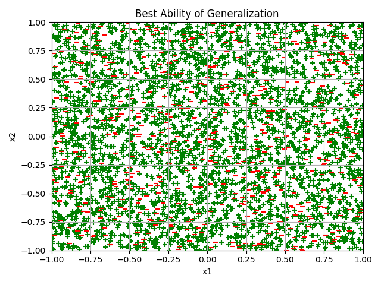

# 🧠 MLP Classifier from Scratch (Java)

A Multi-Layer Perceptron with **three hidden layers**, implemented from scratch in Java (no ML libraries) and trained with **mini-batch gradient descent + backpropagation** to solve a 3-class 2D classification problem.

> Course project — *Computational Intelligence*, Dept. of Computer Science & Engineering, Academic Year 2022-23.



<sub>Test set classified by the best network. Green `+` = correct, red `–` = misclassified.</sub>

---

## 📌 Problem

8000 random points are generated in the square `[-1,1] × [-1,1]` (4000 for training, 4000 for testing). Each point `(x1, x2)` is labelled based on four circles centred at `(±0.5, ±0.5)` (radius² = 0.2):

- Inside a circle and in its upper half → **C1**
- Inside a circle and in its lower half → **C2**
- Outside every circle → **C3**

The network must learn these non-linear, non-convex decision regions.

## 🏗️ Architecture

| Component | Details |
|---|---|
| Inputs | 2 (`x1`, `x2`) |
| Hidden layers | 3 (sizes `H1`, `H2`, `H3` configurable) |
| Hidden activation | Logistic, `tanh` or `ReLU` (configurable) |
| Output layer | 3 neurons, **Softmax** |
| Targets | One-hot: C1=(1,0,0), C2=(0,1,0), C3=(0,0,1) |
| Training | Mini-batch gradient descent, batch size `B` |
| Learning rate | 10⁻³ |
| Stopping rule | ≥ 700 epochs, then stop when the error change between epochs < 10⁻⁵ |
| Initialization | Weights and biases uniform in `[-1, 1]` |

Core functions: `forwardPass(x)` computes the output vector, and `backprop(x, t)` computes the gradients of the error for all weights and biases.

## 📁 Project structure

```
.
├── src/
│   ├── Classification.java   # Generates training.csv / test.csv
│   ├── LoadData.java         # Loads CSVs and one-hot encodes the labels
│   ├── MLP.java              # MLP, forward pass, backprop, training loop
│   └── Main.java             # Configuration, training, evaluation
├── data/
│   ├── training.csv
│   └── test.csv
├── plot.py                   # Plots correct / wrong test points
├── docs/
│   ├── MLP_report.pdf        # Full report (Greek)
│   ├── assignment.pdf        # Assignment statement
│   └── best_generalization.png
└── README.md
```

> Adjust the paths above to match your actual layout.

## ▶️ How to run

```bash
# 1. (Optional) generate a new random dataset
#    Note: close training.csv and test.csv if they are open in another program
javac *.java
java Classification

# 2. Compile and train the MLP
java Main

# 3. Plot the result (needs Python + matplotlib)
pip install matplotlib pandas
python plot.py
```

Each run of `Main` prints the training error at the end of every epoch, then the final test accuracy, and writes `ypred.txt` (1 = correct, 0 = wrong per test example) for the plot.

## 📊 Results

Test accuracy for different configurations (B = 40 or 400):

| H1-H2-H3 | Activation | B | Train error | Test accuracy |
|---|---|---|---|---|
| 5-5-5 | tanh | 40 | 0.199 | 72.8% |
| 10-7-4 | tanh | 400 | 0.195 | 72.5% |
| 20-15-7 | tanh | 40 | 0.100 | 87.0% |
| 28-28-30 | tanh | 400 | 0.100 | 86.7% |
| **28-28-30** | **tanh** | **40** | **0.040** | **92.4%** ⭐ |
| 28-28-30 | relu | 40 | 0.332 | 51.7% |
| 28-28-30 | logistic | 40 | 0.609 | 36.2% |

The full results tables are in [`docs/MLP_report.pdf`](docs/MLP_report.pdf).

### Key takeaways

- **tanh** gave the best generalization. Its zero-centred output makes optimization easier than with the logistic function.
- **Logistic** converges slowly and generalizes poorly.
- **ReLU** converges fast but is unstable. Some runs produced `NaN`, which was fixed by lowering the learning rate and retraining.
- **More neurons** per hidden layer improved results, mostly for tanh and ReLU, at the cost of longer training.
- **Smaller batches (B = 40)** gave equal or better accuracy than B = 400.
- Results depend on the random weight initialization.

## 👥 Authors

- Vasileios Skarafigas
- Konstantinos Christopoulos

## 📄 License

Released for educational purposes. Add a license (e.g. MIT) if you want others to reuse the code.
